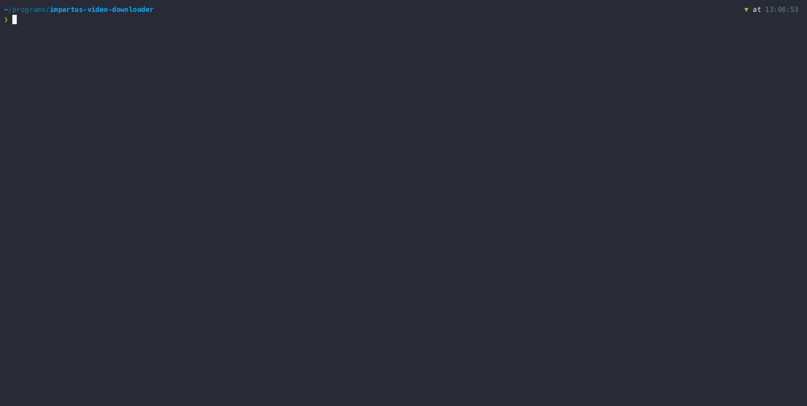

# impartus video downloader

-   [impartus video downloader](#impartus-video-downloader)
    -   [Demo](#demo)
    -   [How to use](#how-to-use)
        -   [Selecting lectures](#selecting-lectures)
    -   [Configuration](#configuration)

## Demo



## How to use

-   Have [ffmpeg](https://ffmpeg.org/download.html) installed on your pc and have it in your **PATH**.
-   [Download](https://github.com/pnicto/impartus-video-downloader/releases/latest) the latest release and extract it.
-   Add your username/email and password in `config.json`.
-   Make suitable changes to the config as per your needs. Read [here](#configuration) for more information on configuration.
-   Execute the binary.

### Selecting lectures

When prompted to enter a range do the following

-   Enter the numbers shown on the left (not the lecture number after "LEC")
-   If you want lectures from 1 to 10, this is how your input will be `1 10`. The range is inclusive.
-   If you want only 1 lecture say 5, your input should be `5 5`.
-   Make sure you add space between the start and end.

## Configuration

The comments beside the fields tell the allowed values.

```jsonc
{
    "username": "uid@hyderabad.bits-pilani.ac.in",
    "password": "password",
    "baseUrl": "http://bitshyd.impartus.com/api", // Accepted values: "http://bitshyd.impartus.com/api", "http://172.16.3.20/api"
    "quality": "720", // Accepted values: "720", "450", "144"
    "views": "both", // Accepted values: "left", "right", "both"
    "downloadLocation": "./downloads", // Directory where the final file is stored to
    "tempDirLocation": "./.temp", // Directory to store the chunks (directory can be deleted when the program is not running)
    "slides": false, // Accepted values: true, false to download the slides from impartus,
    "numWorkers": 5 // Number of workers to use set this to 1 if you want to download the videos sequentially. Setting this to 0 will use a default number that is 5
}
```
